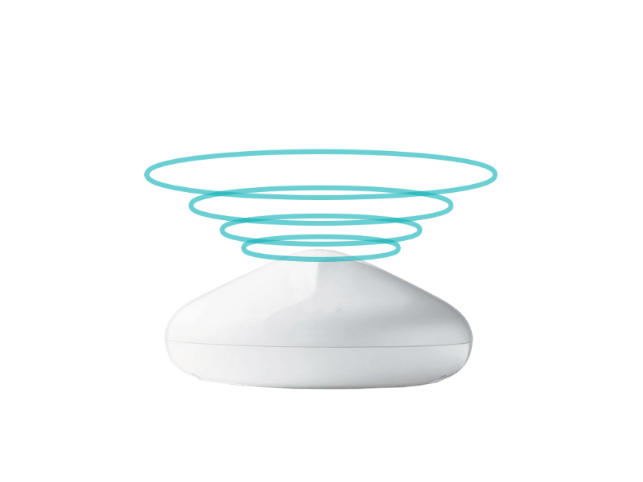

<header class="section-1">
  

  

    <h2>"Innocuous Wireless Charging Solutions"</h2>
    <h3 id="section_1_h3" class="animated-hidden">We transform the problem of cable charging into different efficient and innovative wireless charging solutions.</h3>
  

</header>
<section class="section-2">
  <h2>Uninterrupted Energy</h2>
  
Experience real wireless energy and charge electrical devices through the air.

</section>
<section class="section-3" id="section-3">
  

  

    

      

        
      

      

        <h2>Carefully Designed and Engineered for you.</h2>
        
We carefully design and build wireless charging solutions, products and technologies to keep electrical devices used in different industries like mining, medical devices, electric cars, smarthome, among other charged all the time. Our values and purpose are:

        
<i class="fa fa-leaf"></i>Harmless for People and Environment

        
<i class="fa fa-battery-full"></i>Good Charging Experience

        
<i class="far fa-clock"></i>Improved distance and charging speed

      

    

  

</section>
<section class="section-4">
  <h2>Where it will be available</h2>
  
Our technology match different use-cases and can be applied to different kind of electrical products among other, in:

  

    

      

        

          <h2>Medical Devices</h2>
          
        

      

      

        

          <h2>Electric Transport</h2>
          
        

      

      

        

          <h2>Mining</h2>
          
        

      

    

  

</section>
<section class="section-5" id="section-5">
  <h2>Have questions? We've got answers.</h2>
  

    

      

        
<i class="far fa-life-ring"></i>

        
Find answers

        
<a href="./contact-us.html">Help Center <i class="fa fa-arrow-right"></i></a>

      

      

        
<i class="fa fa-university"></i>

        
Apply your Knowledge

        
<a href="./research-program.html">Research Programs <i class="fa fa-arrow-right"></i></a>

      

      

        
<i class="fab fa-wpforms"></i>

        
Break Technological Barriers

        
<a href="https://goo.gl/forms/wJCzyBT6n0PDMShl1" target="_blank">Join Us <i class="fa fa-arrow-right"></i></a>

      

    

  

</section>
      

